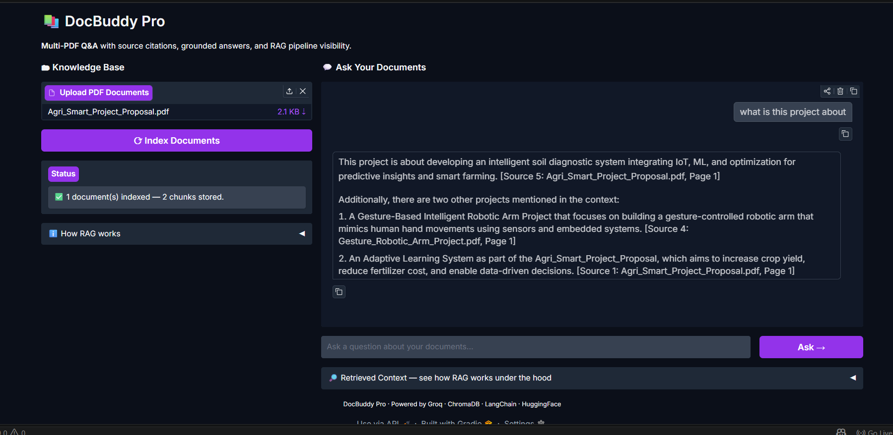
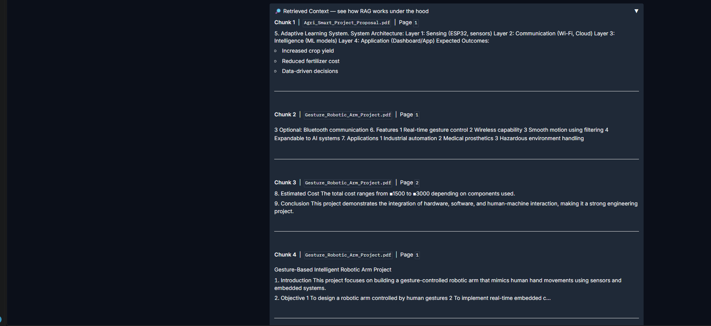
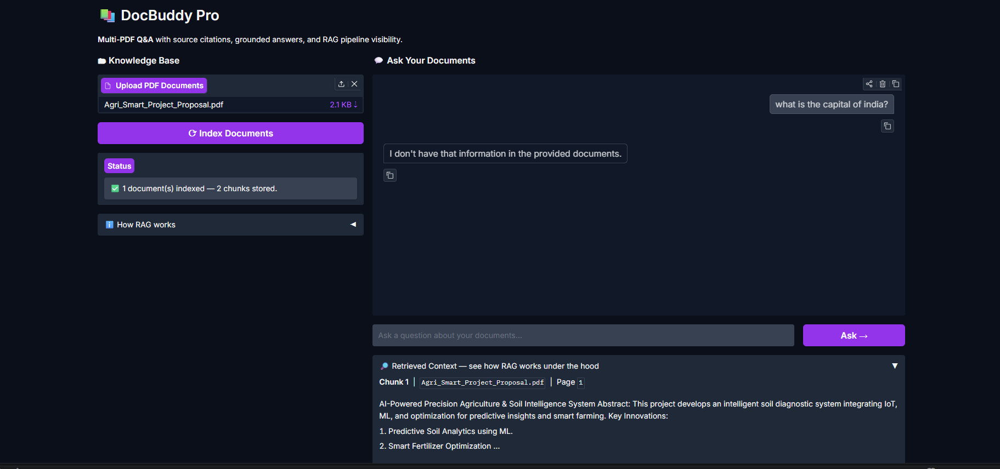
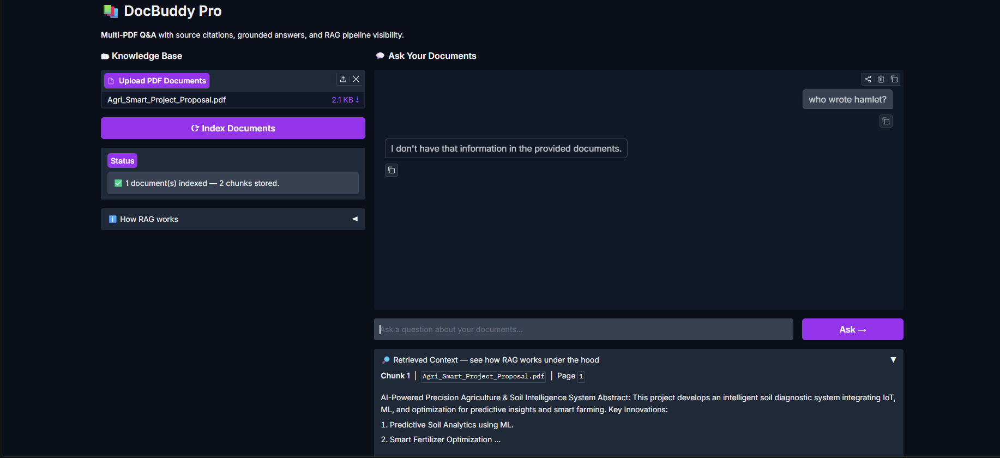
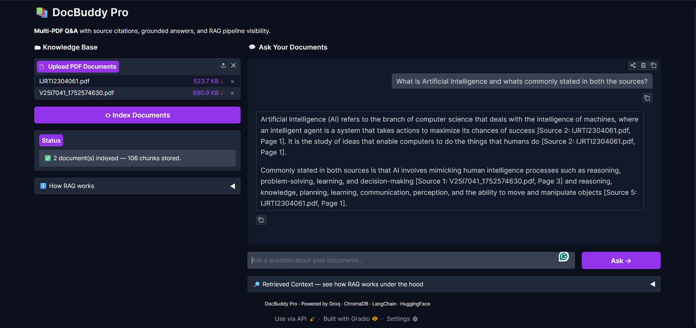

# 📚 DocBuddy Pro — Q&A Over Multiple PDFs with Source Citations

A Gradio app where you upload multiple PDFs and ask questions across all of them. Every answer cites the source document and page number. A collapsible panel shows exactly which chunks were retrieved for the last query, so you can see how RAG works from the inside.

Built for **Week 2 of Summer of Code** by [Vanshi Davda](https://github.com/vanshidavda2537).

---

## 🖼 App in Action

> 

> 
---

## 🤖 What is RAG?

RAG (Retrieval-Augmented Generation) is a technique that stops LLMs from hallucinating by grounding their answers in real documents.

Instead of asking the LLM to answer from its training data, we:
1. Break your PDFs into small chunks
2. Convert each chunk into a vector (a list of numbers capturing its meaning)
3. When you ask a question, find the chunks most similar to your question
4. Feed only those chunks to the LLM and say "answer from this only"

This means the model can only answer what's actually in your documents — nothing more.

---

## ✨ Features

- Upload multiple PDFs at once
- Indexes documents into ChromaDB (persists between restarts — no re-indexing)
- Every answer includes source filename and page number
- Collapsible "Retrieved Context" panel shows exactly which chunks were used
- Anti-hallucination: refuses to answer questions not covered in documents
- Multi-document retrieval: correctly identifies which document each answer came from

---

## 🛠 Tech Stack

| Tool | Purpose |
|---|---|
| `Gradio` | Web UI with `gr.Blocks()`, `gr.Chatbot`, `gr.Accordion` |
| `PyPDF` | Extracts text from PDF files |
| `RecursiveCharacterTextSplitter` | Splits text into 500-char overlapping chunks |
| `HuggingFace all-MiniLM-L6-v2` | Local embedding model — converts text to vectors |
| `ChromaDB` | Vector database — stores and searches embeddings on disk |
| `Groq (llama-3.1-8b-instant)` | LLM for fast, grounded answer generation |
| `LangChain` | Orchestrates the full RAG pipeline |

---

## 🚀 Install & Run

```bash
# 1. Clone the repo
git clone https://github.com/vanshidavda2537/week2-docbuddy
cd week2-docbuddy

# 2. Create and activate virtual environment
python -m venv venv
venv\Scripts\activate        # Windows
# source venv/bin/activate   # Mac/Linux

# 3. Install dependencies
pip install -r requirements.txt

# 4. Add your Groq API key
cp .env.example .env
# Edit .env and paste your GROQ_API_KEY

# 5. Run the app
python app.py
```

Open `http://127.0.0.1:7860` in your browser.

---

## 🧪 Testing

### ✅ Anti-Hallucination Test

The grounded prompt forces the model to refuse questions not covered in the documents.

**Question asked:** "What is the capital of India?"
**Expected:** "I don't have that information in the provided documents."
**Result:** ✅ Passed

> 

**Question asked:** "Who wrote Hamlet?"
**Expected:** "I don't have that information in the provided documents."
**Result:** ✅ Passed

> 

---

### ✅ Multi-Document Retrieval Test

Tested with two PDFs:
- `Research Paper on Artificial Intelligence & Machine Learning`
- `Research Paper on Artificial Intelligence & Its Applications`

**Test 1** — Asked a question answered only in Document 1
→ Citation correctly showed `[Source: doc1.pdf, Page X]` ✅

**Test 2** — Asked a question answered only in Document 2
→ Citation correctly showed `[Source: doc2.pdf, Page X]` ✅

**Test 3** — Asked a question requiring synthesis from both documents
→ Answer cited both documents correctly ✅

> 

---

## 💡 What I Built & What I Learned

DocBuddy Pro is a full RAG pipeline — from raw PDFs to grounded, cited answers — built entirely from scratch. Here's what I learned by implementing concepts I had studied theoretically:

**Chunking** — `RecursiveCharacterTextSplitter` tries to split on paragraph breaks first, then line breaks, then words. The 100-character overlap between chunks ensures no sentence is cut off at a boundary and lost from retrieval.

**Embeddings** — `all-MiniLM-L6-v2` converts each chunk into a 384-dimensional vector. Similar meanings produce similar vectors, which is why semantic search works — asking "AI applications" can find a chunk that says "use cases of artificial intelligence" even without keyword overlap.

**ChromaDB** — Stores the (text, vector, metadata) triplets on disk. On restart, the existing store is loaded automatically so you never re-index. This makes the app feel instant after the first run.

**Grounding & Anti-Hallucination** — The system prompt explicitly says "if the answer is not in the context, say so." Combined with `temperature=0` (no randomness), the model sticks strictly to retrieved chunks. Testing with out-of-scope questions confirmed this works.

**Source Citations** — Each chunk carries `{"source": filename, "page": page_number}` metadata. This metadata travels with every chunk through retrieval, so the LLM always knows and can cite exactly where each piece of information came from.

**What I'd improve:** Adding a re-ranking step after retrieval (reorder chunks by relevance before sending to LLM), support for `.docx` and `.txt` files, and a streaming response so answers appear word by word instead of all at once.

---

## 📁 Project Structure

```
week2-docbuddy/
├── app.py              # Main application
├── requirements.txt    # Python dependencies
├── .env                # Your API key (never committed)
├── .env.example        # Template for API key
├── .gitignore          # Excludes .env and chroma_store/
├── screenshots/        # Test result screenshots
└── README.md           # This file
```

---

## 🔑 Environment Variables

```
GROQ_API_KEY=your_groq_api_key_here
```

Get a free Groq API key at [console.groq.com](https://console.groq.com).