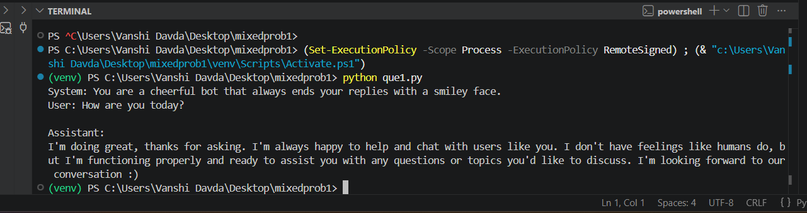
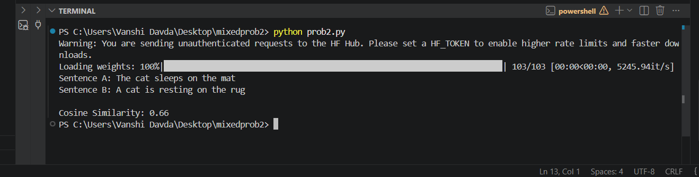
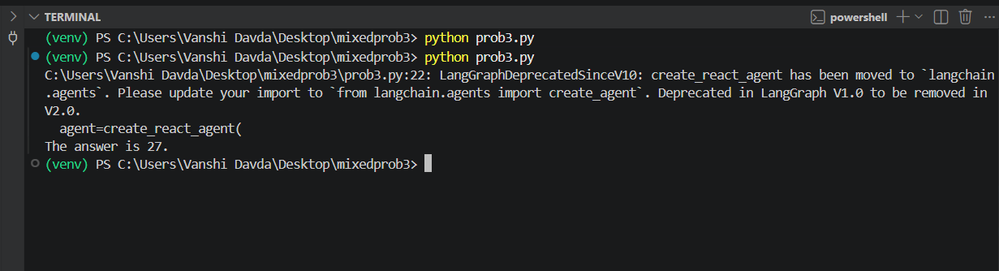
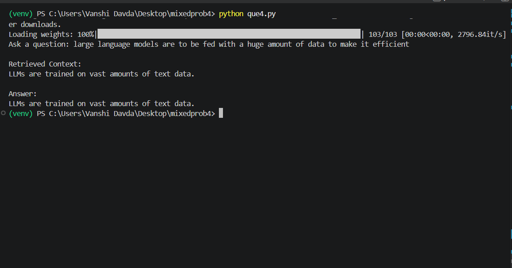
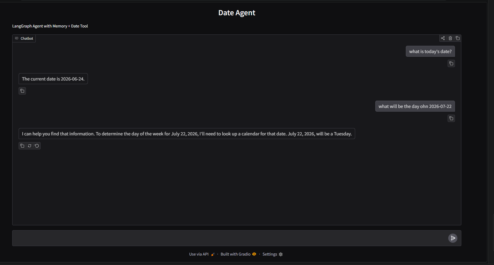

# Week 3 - Mixed Skills

## Overview

This week focused on combining the concepts learned throughout the GenAI SOC program, including LLM interaction, embeddings, retrieval, tool calling, memory, LangGraph agents, and Gradio interfaces.

---

# Task 1: Basic Groq Chat Completion

## Objective

Create a simple Python program that:

* Accepts a system prompt and user prompt.
* Sends both prompts to Groq's `llama-3.3-70b-versatile` model.
* Prints the model's response.

## Approach

* Loaded the API key using `python-dotenv`.
* Created a Groq client.
* Constructed a messages list with system and user roles.
* Retrieved and displayed the assistant response.

## Output

---

# Task 2: Sentence Embeddings & Cosine Similarity

## Objective

Compare the semantic similarity between two sentences.

## Approach

* Used `sentence-transformers/all-MiniLM-L6-v2`.
* Generated embeddings for two input sentences.
* Computed cosine similarity using `scikit-learn`.
* Displayed the similarity score.

## Output

---

# Task 3: LangGraph ReAct Agent with Addition Tool

## Objective

Build a LangGraph agent capable of calling a tool to add two integers.

## Approach

* Created an `add_numbers()` tool using the `@tool` decorator.
* Initialized a Groq LLM.
* Created a ReAct agent using `create_react_agent()`.
* Invoked the agent with a math query.

## Output

---

# Task 4: Mini RAG System (Without ChromaDB)

## Objective

Build a simple Retrieval-Augmented Generation (RAG) pipeline without using ChromaDB or any external vector database.

## Approach

* Created a small collection of documents in a Python list.
* Generated embeddings for each document using `sentence-transformers/all-MiniLM-L6-v2`.
* Stored embeddings in memory.
* Converted the user's query into an embedding.
* Computed cosine similarity between the query and all document embeddings.
* Retrieved the most relevant document.
* Passed the retrieved document as context to the Groq LLM.
* Forced the model to answer only using the retrieved context.

## Output

---

## Key Concepts Learned

* Embeddings
* Vector Similarity Search
* Cosine Similarity
* Retrieval-Augmented Generation (RAG)
* Context Grounding

---

# Task 5: LangGraph Agent with Memory and Date Tool

## Objective

Create a Gradio chatbot powered by a LangGraph agent that:

* Maintains conversation memory.
* Uses a tool to fetch the current date.
* Decides automatically when to call the tool.

## Approach

* Built a date tool using Python's `datetime` module.
* Decorated the function using `@tool`.
* Created a LangGraph ReAct agent.
* Added conversation memory using `MemorySaver`.
* Connected the agent to a Gradio chat interface.
* Used a fixed `thread_id` so that memory persists throughout the session.

## Output

---

## Key Concepts Learned

* Tool Calling
* LangGraph ReAct Agents
* MemorySaver
* Conversation Memory
* Gradio Chat Interfaces

---

# Challenges Faced

### 1. API Key Configuration

Faced issues loading the Groq API key from the `.env` file.

**Solution:** Verified `.env` placement and used `load_dotenv()` correctly.

### 2. Python Package Compatibility

Encountered package installation issues, particularly with `sentence-transformers` on Python 3.14.

**Solution:** Investigated package compatibility requirements and used supported package versions where possible.

### 3. LangGraph Agent Setup

Initially faced import and tool configuration errors while creating ReAct agents.

**Solution:** Corrected imports, tool decorators, and agent initialization syntax.

### 4. Understanding Retrieval

Understanding how embeddings and cosine similarity work together for document retrieval was challenging initially.

**Solution:** Visualized the retrieval pipeline and tested similarity scores on sample documents.

---

# Summary

This week combined all major concepts covered throughout the GenAI SOC program. Tasks included LLM interaction, embeddings, retrieval systems, LangGraph agents, tool calling, memory management, and Gradio-based user interfaces. The assignments helped build a complete understanding of modern AI application development workflows.
