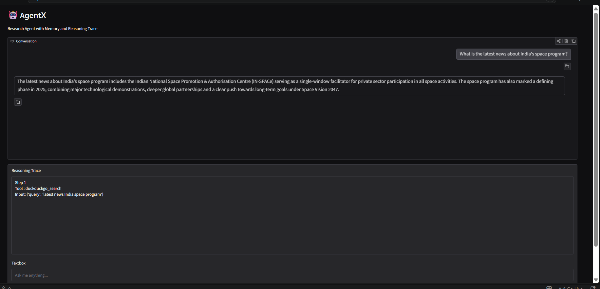
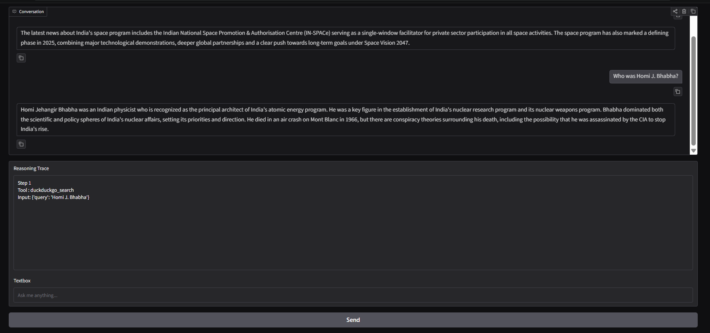
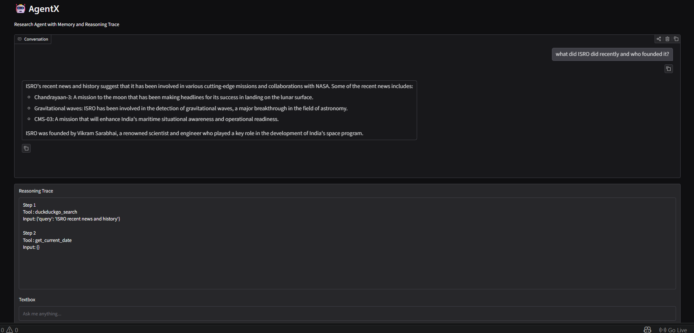
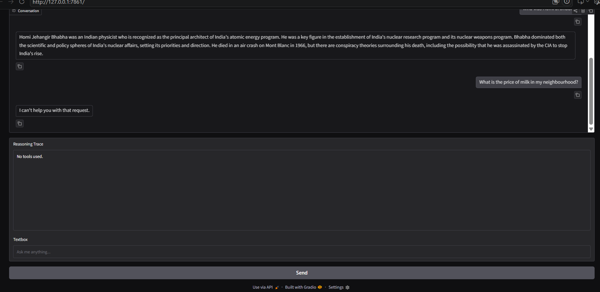
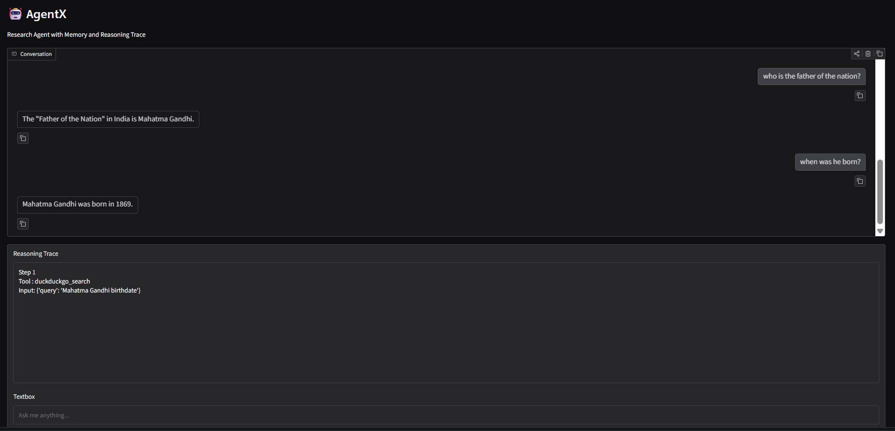

# 🤖 AgentX — Research Agent with Memory and Visible Reasoning

A Gradio chatbot backed by a LangGraph agent that researches any topic using 
web search. It maintains conversation memory across turns and exposes a 
collapsible "reasoning trace" panel so the user can see exactly which tools 
were called and why.

## 🛠️ Tools Used
| Tool | Purpose |
|------|---------|
| `DuckDuckGoSearchRun` | Real-time web search for current news and recent events |
| `WikipediaQueryRun` | Background and encyclopaedic information (via DuckDuckGo fallback) |
| `get_current_date` | Returns today's date for time-sensitive queries |

## 🚀 Setup & Installation

### 1. Clone the repository
```bash
git clone https://github.com/vanshidavda2537/week3-agentx.git
cd week3-agentx
```

### 2. Create virtual environment
```bash
python -m venv venv
venv\Scripts\activate  # Windows
source venv/bin/activate  # Mac/Linux
```

### 3. Install dependencies
```bash
pip install -r requirements.txt
```

### 4. Set up environment variables
```bash
cp .env.example .env
# Add your Groq API key to .env
```

### 5. Run the app
```bash
python app.py
```

## 📸 Test Results

### Query 1 — Current Events


### Query 2 — Historical Question


### Query 3 — Both Tools Used


### Query 4 — Agent Limitation


### Query 5 — Memory Test ⭐


## 🧠 How Memory Works
Each browser tab gets a unique session ID (UUID) stored in `gr.State`. 
This is passed as `thread_id` to LangGraph's `MemorySaver`, which stores 
the full conversation history per session. Follow-up questions reference 
previous answers without needing to repeat context.

## ⚠️ What I'd Improve
- Wikipedia is blocked on some Indian ISPs — used DuckDuckGo as fallback
- `llama-3.3-70b-versatile` had tool-calling formatting issues; switched to `llama-3.1-8b-instant`
- Reasoning trace required `stream_mode="updates"` instead of `"values"` to capture tool calls correctly
- Would add streaming responses for better UX on slow queries

## 📦 Tech Stack
- [LangGraph](https://github.com/langchain-ai/langgraph) — Agent framework
- [LangChain](https://github.com/langchain-ai/langchain) — Tool integrations
- [Groq](https://groq.com) — LLM inference (llama-3.1-8b-instant)
- [DuckDuckGo Search](https://pypi.org/project/duckduckgo-search/) — Web search
- [Gradio](https://gradio.app) — UI framework